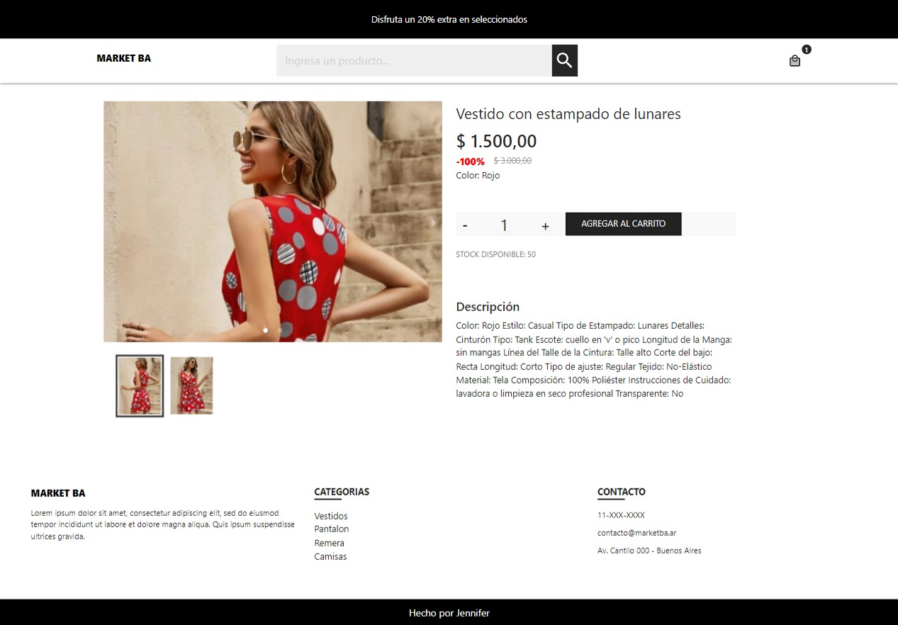

# Front-End de sitio Ecommerce - Modulo01
 
  <a href="https://jennifersanchez-ecommerce-example.netlify.app/"> Sitio en vivo </a>
--------------

## Página Principal
Sitio personalizable desde gestor de productos, donde se indican productos destacados y ofertas.

## Productos

## Detalle

## Carrito

## Checkout

## Orden

 
 